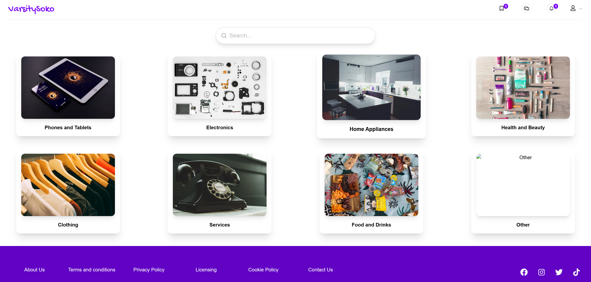
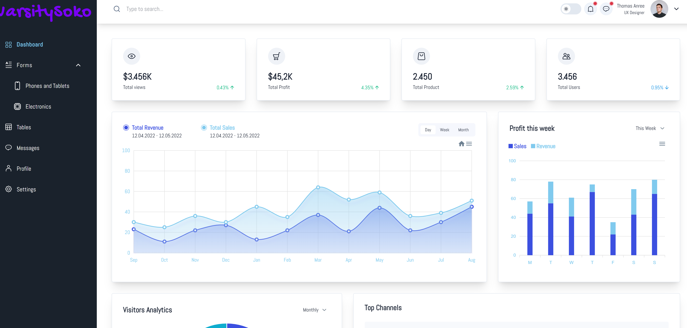
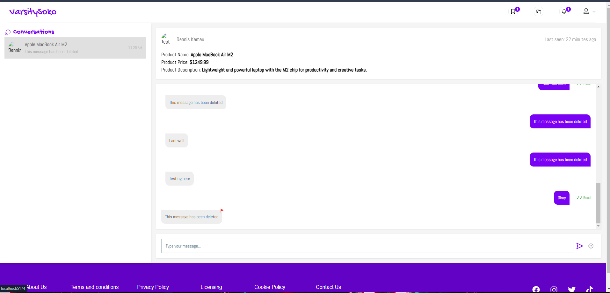
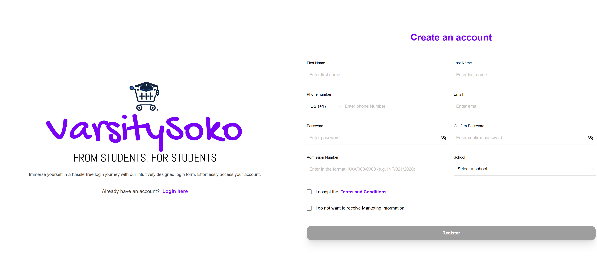
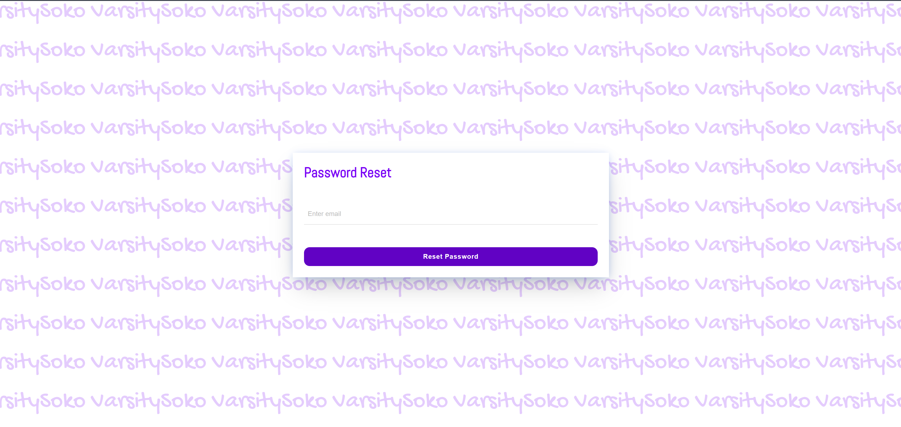
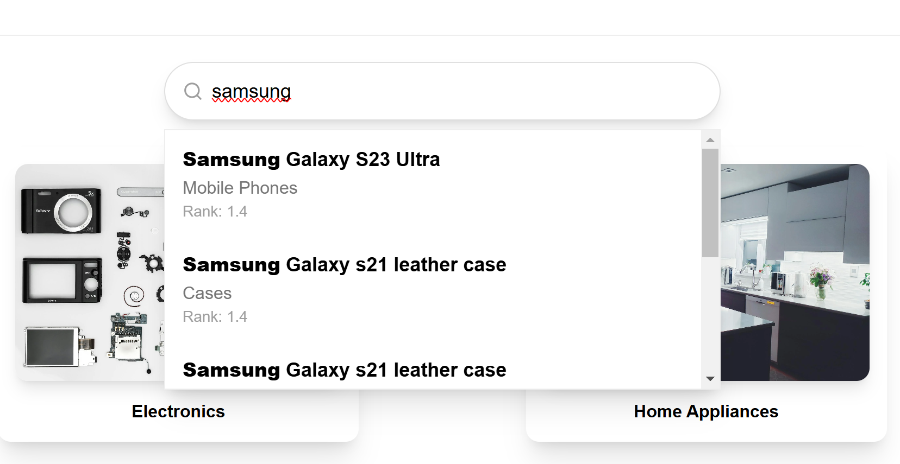

# VarsitySoko 🛒🎓 - University Marketplace

VarsitySoko is an e-commerce platform designed for university students to **buy and sell products & services** within their campus.

## 🎯 Key Features

### 🔎 Smart Search & Category Filters  
Easily find products or services using keywords, categories, and filters. VarsitySoko suggests **top results** and **category-based recommendations** for a smooth browsing experience.  

### 📩 In-App Messaging  
Buyers and sellers can chat directly within the platform, ensuring **secure communication** without needing external apps. Messages include **read receipts** and are tied to specific products.  

### 📊 Seller Analytics Dashboard  
Sellers get a **personalized dashboard** with insights into their sales, product views, and customer interactions. This helps optimize listings and pricing.  

### 📍 University-Based Listings  
Unlike other marketplaces, VarsitySoko ensures that listings are **restricted to students within the same university**, preventing scams and keeping transactions local.  

### 🔒 Secure Transactions *(Coming Soon)*  
A built-in **trusted delivery & payment system** will allow verified businesses to handle transactions, ensuring **safe exchanges** between students.  

---

## 📸 Screenshots

### 🔹 Buyer Dashboard

### 🔹 Seller Dashboard

### 🔹 Buyer Messaging Feature

### 🔹 Seller Messaging Feature

### 🔹 Login Page

### 🔹 Register Page

### 🔹 Password Reset

### 🔹 Search Feature

### 🔹 Seller Forms

### 🔹 Seller Forms 2

---

## 🔗 Connect & Stay Updated

Follow the development of VarsitySoko!  
📧 Contact: [denniskamau1803@gmail.com](mailto:denniskamau1803@gmail.com)  
🌐 Website: Email for demo preview
